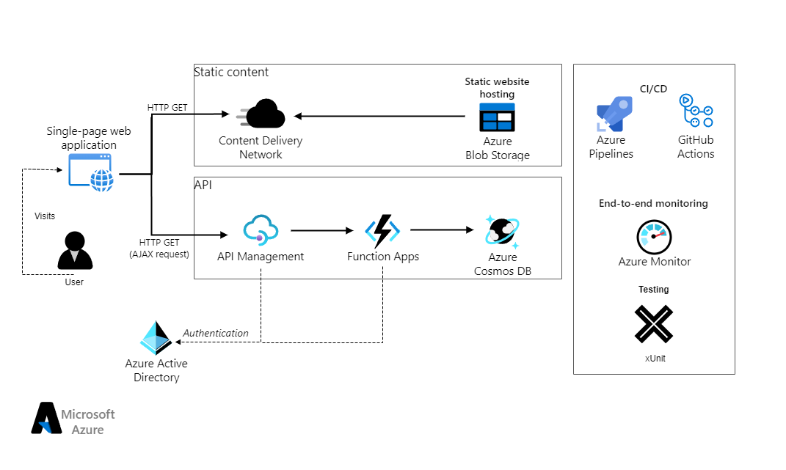

# Azure Resume Website

The static website is made with Bootstrap 5 and is hosted on Azure Blob Storage. The visitor counter that is updated after each page visit is done through a function on the [backend.](https://github.com/Kinda-Nefarious/azure-resume-backend)

You can read further about the project on my blog [post.](https://blog.rufaronyakudya.com/azure-resume-challenge)

View the website live [here.](https://resume.rufaronyakudya.com/)

The website also serves as the resume page of my [portfolio website.](https://www.rufaronyakudya.com/)

## Architecture

### Technologies used

- Javascript
- HTML
- Github (Source Control)
- Github Actions (CI/CD)
- Azure Blob Storage
- Azure CDN
- Xunit testing

## Project Goals

The purpose of this project is to show that one is capable of developing and deploying a cloud-based website utilizing Azure services. Using Azure services, the website is completely managed, scalable, and economical. The project demonstrates how to automate the deployment process so that the website is constantly current and functional by using continuous integration, and deployment.

This project also serves to illustrate the architecture and workings  of a decoupled web application through the seperated frontend and [backend.](https://github.com/Kinda-Nefarious/azure-resume-backend)

## Further Work Planned

- Improve CI/CD pipeline to further meet industry standards
- Further leverage IaC to increase automation in project
- Secure the app at both frontend and backend
- Add monitoring

## License
Licensed under MIT License.